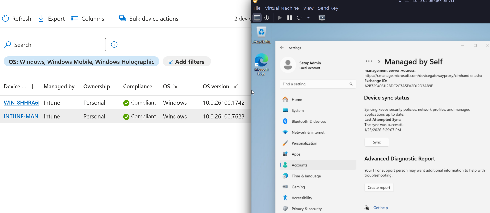
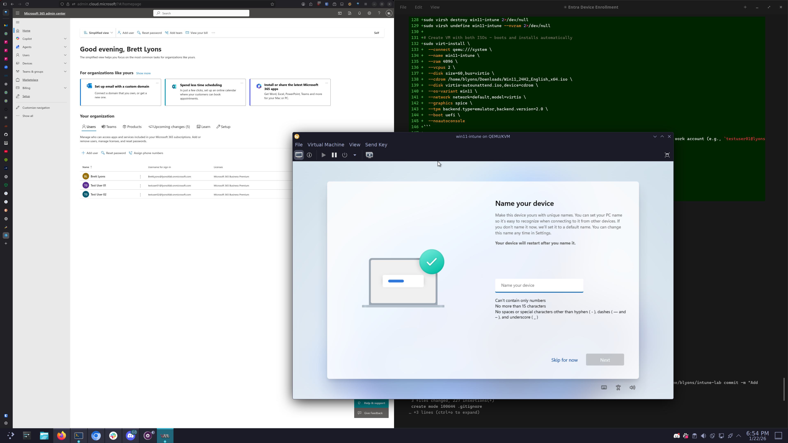
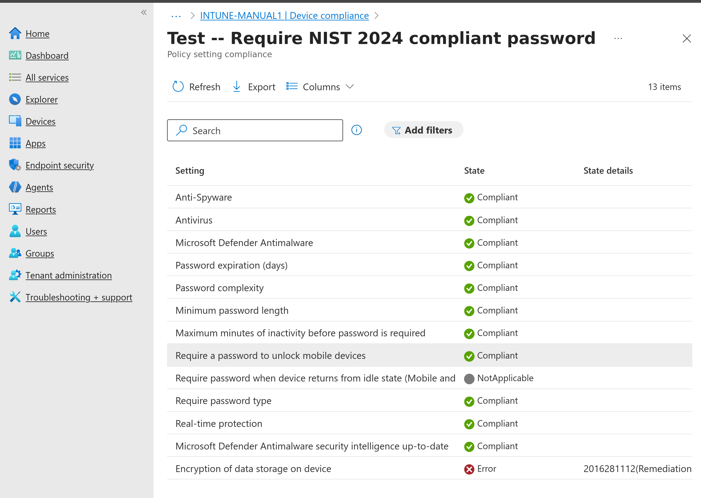
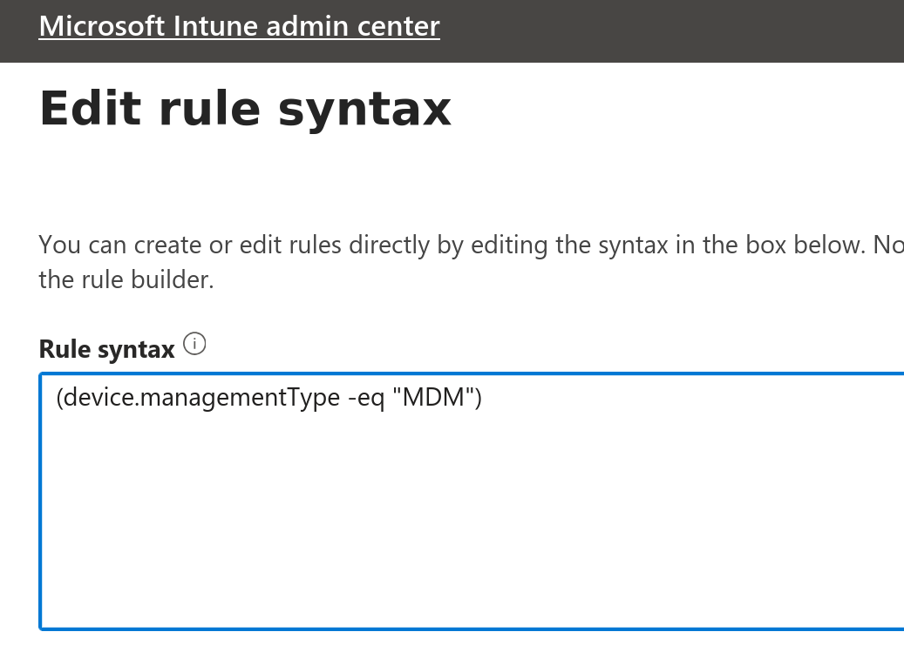

# Intune Lab – Initial Notes

## Objective
Establish a Microsoft Intune test environment and validate basic device enrollment and policy application.

## Environment
- Microsoft 365 Business Premium Trial (M365 Developer Program sandbox was unavailable)
- Tenant: lyonsitlab.onmicrosoft.com
- Entra ID
- Microsoft Intune
- Windows 10/11 test device (local QEMU/KVM VM)

### VM Options Considered
- **Azure VM**: ~$170/mo for D2 Windows instance (Azure offers $200 free credits for new accounts)
- **Local QEMU/KVM**: Free, requires Windows ISO from Microsoft evaluation center or existing media

### Virsh/libvirt Quick Reference

**GUI Management:**
```bash
virt-manager                    # Launch graphical VM manager
```

**VM Lifecycle:**
```bash
virsh list --all                # List all VMs (running and stopped)
virsh start <vm-name>           # Start a VM
virsh shutdown <vm-name>        # Graceful shutdown (ACPI)
virsh destroy <vm-name>         # Force stop (like pulling power)
virsh reboot <vm-name>          # Reboot VM
virsh suspend <vm-name>         # Pause VM
virsh resume <vm-name>          # Resume paused VM
```

**VM Creation:**
```bash
# Create VM from ISO (Windows 11 with VirtIO and TPM 2.0)
# Must use sudo and qemu:///system for TPM support via swtpm
sudo virt-install \
  --connect qemu:///system \
  --name win11-intune \
  --ram 4096 \
  --vcpus 2 \
  --disk size=60,bus=virtio \
  --cdrom /home/blyons/Downloads/Win11_24H2_English_x64.iso \
  --os-variant win11 \
  --network network=default,model=virtio \
  --graphics spice \
  --tpm backend.type=emulator,backend.version=2.0 \
  --boot uefi \
  --noautoconsole
```

**VirtIO Drivers (NixOS):**
- Package: `virtio-win` (added to `system.nix` environment.systemPackages)
- Location: `/nix/store/*-virtio-win-*/`
- Contains: Driver directories for disk (viostor), network (NetKVM), balloon, etc.
- Windows installer: `virtio-win-guest-tools.exe` in package root

**Required for Windows Install with VirtIO disk**:

When using `bus=virtio` for the disk, Windows installer will show **no drives available** at the "Where do you want to install Windows?" screen. This is because Windows doesn't have VirtIO drivers built-in.

**Solution**: Load the VirtIO storage driver (viostor) during installation. However, the NixOS `virtio-win` package contains extracted driver directories, NOT an ISO file, so you must first create an ISO and attach it to the VM.

1. Create an ISO from the nix store directory:
```bash
nix-shell -p cdrtools --run "mkisofs -o /tmp/virtio-win.iso -J -r /nix/store/*-virtio-win-*/"
```

2. Attach ISO to running VM:
```bash
# This fails - SATA cannot be hotplugged:
sudo virsh attach-disk win11-intune /tmp/virtio-win.iso sdb --type cdrom --mode readonly --targetbus sata
# error: Operation not supported: disk bus 'sata' cannot be hotplugged.

# Use USB instead:
sudo virsh attach-disk win11-intune /tmp/virtio-win.iso sdb --type cdrom --mode readonly --targetbus usb
```

3. In Windows installer at "Where do you want to install Windows?":
   - Click "Load driver"
   - Click "Browse"
   - Navigate to USB drive → `viostor/w11/amd64`
   - Select the driver and click OK
   - The 60GB VirtIO disk will now appear

## Unattended Windows Installation

**Problem**: Manual Windows installation requires multiple interactions:
- Clicking through language/region selection
- Manually loading VirtIO drivers when disk isn't visible
- Partitioning the disk
- Clicking through OOBE screens
- Setting up user accounts

This makes it tedious to spin up fresh VMs for testing, and the VirtIO driver step is easy to forget.

**Solution**: Use `Autounattend.xml` answer file for fully automated installation.

The `Autounattend.xml` in this repo automates:
- Language/locale (en-US)
- Skips product key (evaluation)
- Auto-partitions disk (GPT/UEFI: EFI + MSR + Windows partitions)
- Loads VirtIO drivers automatically (tries D:, E:, F: drive letters)
- Auto-generates computer name
- Skips most OOBE screens
- Presents Microsoft/Entra ID sign-in for Intune enrollment

### Creating a Modified Windows ISO (Recommended)

**Quick method**: Use the build script:
```bash
./scripts/build-iso.sh ~/Downloads/Win11_24H2_English_x64.iso
```

The script downloads VirtIO drivers and SPICE tools automatically, works on any Linux distro with `curl` and `xorriso` installed.

**Manual method** (for reference):

**Goal**: Create a fully unattended Windows 11 installation that:
1. Skips "Press any key to boot from CD"
2. Includes VirtIO drivers for disk/network
3. Contains `Autounattend.xml` for automated setup

**Solution**: Modify the Windows ISO to include Autounattend.xml, VirtIO drivers, and use `efisys_noprompt.bin` as the EFI boot loader.

```bash
# 1. Mount the original Windows ISO (read-only)
mkdir -p /tmp/win11_mnt
sudo mkdir -p /tmp/win11_mod
sudo mount -o loop,ro /home/blyons/Downloads/Win11_24H2_English_x64.iso /tmp/win11_mnt

# 2. Copy ISO contents to working directory (use sudo to preserve permissions)
sudo cp -r /tmp/win11_mnt/* /tmp/win11_mod/

# 3. Add Autounattend.xml to root
sudo cp /home/blyons/intune-lab/Autounattend.xml /tmp/win11_mod/

# 4. Add VirtIO drivers
sudo cp -r /nix/store/*-virtio-win-*/{viostor,NetKVM} /tmp/win11_mod/

# 5. Add SPICE guest tools for clipboard/display integration
# Download if not already present
[ -f /tmp/spice-guest-tools.exe ] || curl -L -o /tmp/spice-guest-tools.exe https://www.spice-space.org/download/windows/spice-guest-tools/spice-guest-tools-latest.exe
sudo cp /tmp/spice-guest-tools.exe /tmp/win11_mod/

# 6. Add drivers to $WinPEDriver$ for automatic loading during WinPE
sudo mkdir -p "/tmp/win11_mod/\$WinPEDriver\$"
sudo cp -r /tmp/win11_mod/viostor/w11/amd64/* "/tmp/win11_mod/\$WinPEDriver\$/"
sudo cp -r /tmp/win11_mod/NetKVM/w11/amd64/* "/tmp/win11_mod/\$WinPEDriver\$/"

# 7. Create modified ISO with xorriso (NOT mkisofs - see "What Didn't Work")
nix-shell -p xorriso --run "xorriso -as mkisofs \
    -iso-level 4 \
    -rock \
    -disable-deep-relocation \
    -untranslated-filenames \
    -b boot/etfsboot.com \
    -no-emul-boot \
    -boot-load-size 8 \
    -eltorito-alt-boot \
    -eltorito-platform efi \
    -b efi/microsoft/boot/efisys_noprompt.bin \
    -no-emul-boot \
    -o /home/blyons/intune-lab/Win11_unattended.iso \
    /tmp/win11_mod"

# 8. Cleanup
sudo umount /tmp/win11_mnt
sudo rm -rf /tmp/win11_mod /tmp/win11_mnt
```

### One-Command VM Creation (Unattended)

```bash
# Remove existing VM if present
sudo virsh destroy win11-intune-02 2>/dev/null
sudo virsh undefine win11-intune-02 --nvram 2>/dev/null

# Create VM with modified ISO - boots and installs fully automatically
sudo virt-install \
  --connect qemu:///system \
  --name win11-intune-02 \
  --ram 4096 \
  --vcpus 2 \
  --disk size=60,bus=virtio \
  --cdrom /home/blyons/intune-lab/Win11_unattended.iso \
  --os-variant win11 \
  --network network=default,model=virtio \
  --graphics spice \
  --tpm backend.type=emulator,backend.version=2.0 \
  --boot uefi \
  --noautoconsole
```

After boot, Windows installs fully automatically:
1. Skips "press any key" (noprompt bootloader)
2. Loads VirtIO drivers for disk/network
3. Partitions and installs Windows 11 Pro
4. Creates SetupAdmin local account
5. Installs SPICE guest tools (clipboard/display integration)
6. Presents Entra ID sign-in at first logon

Sign in with a work account (e.g., `testuser01@lyonsitlab.onmicrosoft.com`) to join Entra ID and auto-enroll in Intune. After login, the device automatically:
- Joins Entra ID
- Enrolls in Intune MDM
- Applies compliance and configuration policies



### What Didn't Work

#### 1. Secondary CD-ROM with Autounattend.xml
**Attempt**: Use original Windows ISO as boot CD, attach second CD-ROM with Autounattend.xml and VirtIO drivers.

```bash
# This approach has issues:
sudo virt-install \
  --cdrom /path/to/Win11.iso \
  --disk virtio-autounattend.iso,device=cdrom \
  ...
```

**Problem**: Still requires "Press any key to boot from CD" and Windows may not reliably find Autounattend.xml on the secondary CD-ROM.

#### 2. mkisofs/genisoimage for Windows ISO creation
**Attempt**: Use `mkisofs` (cdrtools) to create bootable Windows ISO.

```bash
# This command creates a broken ISO:
nix-shell -p cdrtools --run "mkisofs \
    -iso-level 4 \
    -rock \
    -disable-deep-relocation \
    -untranslated-filenames \
    -b boot/etfsboot.com \
    -no-emul-boot \
    -boot-load-size 8 \
    -eltorito-alt-boot \
    -eltorito-platform efi \
    -b efi/microsoft/boot/efisys_noprompt.bin \
    -no-emul-boot \
    -o Win11_unattended.iso \
    /tmp/win11_mod"
```

**Problem**: Results in "Windows Boot Manager - Windows failed to start" error. The `mkisofs`/`genisoimage` tools on Linux don't properly handle Windows boot structures. Use `xorriso -as mkisofs` instead.

#### 3. Missing xmlns:wcm namespace in Autounattend.xml
**Attempt**: Autounattend.xml without proper namespace declaration.

```xml
<!-- This causes Windows Setup to crash (purple screen, then shutdown): -->
<unattend xmlns="urn:schemas-microsoft-com:unattend">
```

**Solution**: Must include the wcm namespace:
```xml
<unattend xmlns="urn:schemas-microsoft-com:unattend" xmlns:wcm="http://schemas.microsoft.com/WMIConfig/2002/State">
```

#### 4. Missing product key in Autounattend.xml
**Attempt**: ProductKey section without actual key value.

```xml
<!-- This stops at "Enter product key" screen: -->
<ProductKey>
    <WillShowUI>OnError</WillShowUI>
</ProductKey>
```

**Solution**: Include the generic Windows 11 Pro key (selects edition, doesn't activate):
```xml
<ProductKey>
    <Key>W269N-WFGWX-YVC9B-4J6C9-T83GX</Key>
    <WillShowUI>OnError</WillShowUI>
</ProductKey>
```

#### 5. Lowercase autounattend.xml filename
**Attempt**: Using `autounattend.xml` (all lowercase).

**Problem**: Windows Setup may not find the file reliably.

**Solution**: Use `Autounattend.xml` (capital A) for consistent detection.

#### 6. DriverPaths not loading VirtIO drivers automatically
**Attempt**: Using `<DriverPaths>` in Autounattend.xml to specify driver locations.

```xml
<DriverPaths>
    <PathAndCredentials wcm:action="add" wcm:keyValue="1">
        <Path>D:\viostor\w11\amd64</Path>
    </PathAndCredentials>
</DriverPaths>
```

**Problem**: Windows Setup reaches "Select location to install Windows" with no disks visible. Manually loading driver from D:\viostor\w11\amd64 works, but DriverPaths isn't processed automatically.

**Solution**: Create a `$WinPEDriver$` folder at the ISO root containing the driver files. Windows PE automatically scans this folder during boot.

```bash
# Add drivers to $WinPEDriver$ folder (in ISO build directory)
sudo mkdir -p "/tmp/win11_mod/\$WinPEDriver\$"
sudo cp -r /tmp/win11_mod/viostor/w11/amd64/* "/tmp/win11_mod/\$WinPEDriver\$/"
sudo cp -r /tmp/win11_mod/NetKVM/w11/amd64/* "/tmp/win11_mod/\$WinPEDriver\$/"
```

### Alternative: Manual "Press Any Key" Approach

If the modified ISO approach doesn't work, you can use a secondary CD-ROM but must manually press a key at boot:

```bash
# Create combined ISO with Autounattend.xml and VirtIO drivers
mkdir -p /tmp/virtio-combined
cp -r /nix/store/*-virtio-win-*/* /tmp/virtio-combined/
cp Autounattend.xml /tmp/virtio-combined/
nix-shell -p cdrtools --run "mkisofs -o virtio-autounattend.iso -J -r /tmp/virtio-combined/"

# Create VM (requires manual "press any key" at boot)
sudo virt-install \
  --connect qemu:///system \
  --name win11-intune \
  --ram 4096 \
  --vcpus 2 \
  --disk size=60,bus=virtio \
  --cdrom /home/blyons/Downloads/Win11_24H2_English_x64.iso \
  --disk virtio-autounattend.iso,device=cdrom \
  --os-variant win11 \
  --network network=default,model=virtio \
  --graphics spice \
  --tpm backend.type=emulator,backend.version=2.0 \
  --boot uefi \
  --noautoconsole
```

### Intune Auto-Enrollment Prerequisites

For automatic Intune enrollment when signing in with a work account:
1. User must have Intune license (included in M365 Business Premium)
2. MDM auto-enrollment enabled in Entra ID:
   - https://entra.microsoft.com → Identity → Devices → Device settings
   - Set "MDM user scope" to "All" or select security group

**Network Autostart (Potential Issue):**
- The default libvirt network may not autostart after reboot
- If VMs fail to start with "network 'default' is not active":
  ```bash
  sudo virsh net-start default
  sudo virsh net-autostart default
  ```
- This is a known NixOS/libvirt quirk - no declarative fix currently
- Consider NixVirt flake for fully declarative network management

**Snapshots:**
```bash
virsh snapshot-create-as <vm> <snapshot-name>  # Create snapshot
virsh snapshot-list <vm>                        # List snapshots
virsh snapshot-revert <vm> <snapshot-name>      # Revert to snapshot
virsh snapshot-delete <vm> <snapshot-name>      # Delete snapshot
```

**Console/Display:**
```bash
virsh console <vm-name>         # Serial console (if configured)
virt-viewer <vm-name>           # Graphical console
```

**Info:**
```bash
virsh dominfo <vm-name>         # VM details
virsh domifaddr <vm-name>       # Get VM IP address
```

## Planned Tasks
- Create test users and groups
- Enroll a Windows device into Intune
- Apply a basic compliance policy
- Apply a simple configuration profile
- Observe and troubleshoot policy assignment behavior

## Automated Intune Configuration

Instead of manually configuring Intune via the admin portal, use the setup script:

```powershell
# Prerequisites (one-time)
Install-Module Microsoft.Graph -Scope CurrentUser

# Run setup (will prompt for login)
./scripts/setup-intune.ps1

# Preview changes without applying
./scripts/setup-intune.ps1 -WhatIf
```

The script creates:
- **Dynamic device group**: Intune-Managed-Devices (all MDM-enrolled devices)
- **Device script**: Remove-SetupAdmin.ps1 (cleanup temp admin)
- **Compliance policy**: Defender enabled, password requirements
- **Configuration profile**: Defender real-time protection settings

All resources are assigned to the dynamic group automatically.

## Change Management
Ticket management handled in Zammad homelab instance. All changes follow a ticketed workflow:
1. Create ticket describing the change
2. Document intended configuration
3. Implement change
4. Update ticket with results
5. Close ticket

## Notes
- Intune workflow is heavily group-driven; incorrect group membership is a common failure point
- Device sync timing matters — forced sync is often required during testing
- Documentation-first approach helps reduce trial-and-error during configuration

## Troubleshooting

### Entra ID Joined but MDM Enrollment Missing

**Symptom**: Device shows as joined to Entra ID, but:
- Settings → Access work or school shows `MDM: None`
- Entra admin center shows device with `MDM: None`
- Device doesn't appear in Intune console
- `dsregcmd /status` may show MDM URLs populated but enrollment didn't register server-side

**Cause**: Device joined Entra ID before MDM auto-enrollment was configured, or auto-enrollment failed silently. The device missed the auto-enrollment window.

**Diagnosis**:
```powershell
# Check device registration and MDM state
dsregcmd /status

# Look for:
# - AzureAdJoined: YES
# - MdmUrl: (populated or blank)
```

**Solution**: Manually trigger MDM enrollment:
```powershell
Start-Process "ms-device-enrollment:?mode=mdm"
```
Sign in with a licensed user (e.g., `testuser01@lyonsitlab.onmicrosoft.com`).



After enrollment, verify:
- Entra portal shows MDM: Microsoft Intune
- Device appears in Intune → Devices → Windows devices

**Prevention**: Ensure MDM auto-enrollment is configured BEFORE devices join Entra ID:
- Intune admin center → Devices → Enrollment → Windows → Automatic Enrollment
- Set MDM user scope to "All" or target security group

### Compliance Policies vs Configuration Profiles

**Compliance policies** - Only *check* if a device meets requirements. They don't configure anything.
- Example: "Require Defender real-time protection" checks if it's enabled
- If not enabled → device marked **non-compliant**
- Non-compliant devices can be blocked from resources via Conditional Access

**Configuration profiles** - Actually *configure* settings on the device.
- Example: "Enable Defender real-time protection" pushes the setting to the device
- Use Settings Catalog for granular control over individual settings

**Typical workflow**:
1. Create configuration profile to push desired settings
2. Create compliance policy to verify settings are in place
3. Device syncs → config applies → compliance evaluates → compliant

**Common mistake**: Creating compliance policy without config profile, then wondering why devices are non-compliant. The compliance policy just checks - it doesn't enable anything.

### BitLocker on VMs

**Observation**: Compliance policy requiring device encryption showed "Error" state on the test VM.



**Workaround used**: Set encryption requirement to **Not configured** in compliance policy to achieve compliant state for testing other policies.

**TODO**: Investigate BitLocker on QEMU/KVM VMs:
- Does the emulated TPM 2.0 (swtpm) support BitLocker?
- What configuration is needed to enable BitLocker in a VM?
- What caused the "Error" state vs simple non-compliance?

### Settings Catalog Tips

When searching for Defender settings in Settings Catalog:
- Settings use different names than the compliance policy
- Search for "Defender" or "Real Time"
- Key settings:
  - **Real Time Scan Direction**: `Monitor all files (bi-directional)`
  - **Allow Cloud Protection**: `Allowed`
  - **Allow Behavior Monitoring**: `Allowed`

### Entra ID Join Not Completing During OOBE

**Symptom**: After unattended install completes:
- Device boots to SetupAdmin desktop
- MDM enrollment dialog may appear but user closes/ignores it
- `dsregcmd /status` shows `AzureAdJoined: NO`
- No "Other user" option on lock screen - only SetupAdmin appears

**Cause**: The `Autounattend.xml` launches the MDM enrollment dialog via `ms-device-enrollment:?mode=mdm`, but this only opens the dialog - the user must complete sign-in. If dismissed or not completed, the device remains local-only.

**Diagnosis**:
```powershell
# Check Entra join status
dsregcmd /status

# Look for:
# AzureAdJoined: YES or NO
# DomainJoined: YES or NO
# WorkplaceJoined: YES or NO (registered but not joined)
```

**Solution**: Manually join Entra ID:
```powershell
# Open work/school settings
Start-Process "ms-settings:workplace"
```
Then:
1. Click **Connect**
2. Select **Join this device to Microsoft Entra ID** (the option that says it will give the organization full control of the device)
3. Sign in with licensed user (e.g., `testuser01@lyonsitlab.onmicrosoft.com`)
4. Confirm the join
5. Reboot - Entra user now appears on lock screen

**Note**: There are two similar options - make sure to pick the Entra ID join that gives organization full control, NOT the option that just adds a work/school account. The latter only *registers* the device without enabling MDM control or Entra user sign-in at the lock screen.

**Prevention**: Consider Windows Autopilot or provisioning packages for fully automated Entra join without user interaction.

### SetupAdmin Account Persists After Enrollment

**Symptom**: After Entra ID enrollment completes and the device sleeps/locks, Windows prompts for the SetupAdmin password instead of the enrolled user.

**Cause**: The `Autounattend.xml` creates a temporary local admin account (`SetupAdmin`) to bypass OOBE. This account persists after enrollment and appears on the lock screen.

**Solution**: Deploy a PowerShell script via Intune to remove the SetupAdmin account after enrollment.

1. In Intune admin center, go to **Devices > Scripts and remediations > Platform scripts**
2. Create a new script, upload `scripts/Remove-SetupAdmin.ps1`
3. Configure:
   - Run this script using the logged on credentials: **No**
   - Run script in 64 bit PowerShell Host: **Yes**
4. Assign to **Intune-Test-Devices** group (or All Devices)

The script runs after enrollment, ensuring the device is managed before cleanup occurs.

**Alternative approaches considered**:
- Scheduled task in Autounattend.xml: More complex, runs before enrollment is confirmed
- Proactive remediation: Overkill for one-time cleanup

## Dynamic Device Groups

Static device groups require manually adding each device after enrollment. Dynamic groups automatically include devices matching a rule.

### Creating a Dynamic Device Group for Intune-Managed Devices

1. Go to **Entra admin center** > **Groups** > **New group**
2. Configure:
   - **Group type**: Security
   - **Group name**: Intune-Managed-Devices
   - **Group description**: All devices enrolled in Intune MDM
   - **Membership type**: Dynamic Device
3. Click **Add dynamic query**
4. Enter rule:
   ```
   (device.managementType -eq "MDM")
   ```
5. Click **Save** > **Create**



The group will automatically populate with all Intune-enrolled devices. New enrollments appear within minutes (though Azure AD can take up to 24 hours in some cases).

**Usage**: Assign scripts, compliance policies, and configuration profiles to this group instead of static groups. New devices automatically receive all assignments.

**Note**: You can keep the static `Intune-Test-Devices` group for testing policies on specific devices before broader rollout.

## Next Steps
- Test automated VM deployment with Autounattend.xml
- Document additional troubleshooting scenarios
- Explore Conditional Access policies
